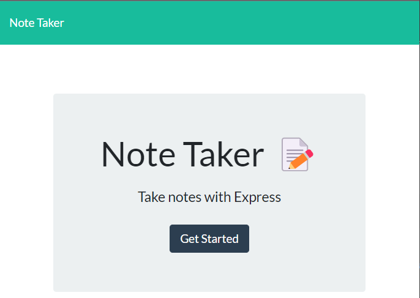
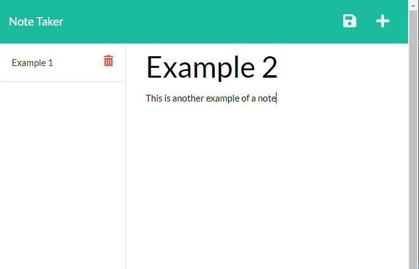

# Note Taking App
  

## Description

This is an application to write and store notes. It works by the user entering in a title and a note and then saves it to a json file. 

## Table of Contents

- [Installation](#installation)
- [Usage](#usage)
- [Contributing](#contributing)
- [Tests](#tests)
- [Questions](#questions)

## Installation

Use the following code in the command line to install the application:

    npm i

## Usage

This application has been deployed on [Heroku](https://notetakingapplication-dmm.herokuapp.com/).

If utilizing the code locally, use the following code in the command line to run the application:

    npm start

## Contributing

This application does not allow contributions

## Tests

There are no tests associated with this application

## Questions

GitHub Account:  [dmmerchant](https://github.com/dmmerchant)

Email Address: dmmerchant@gmail.com

